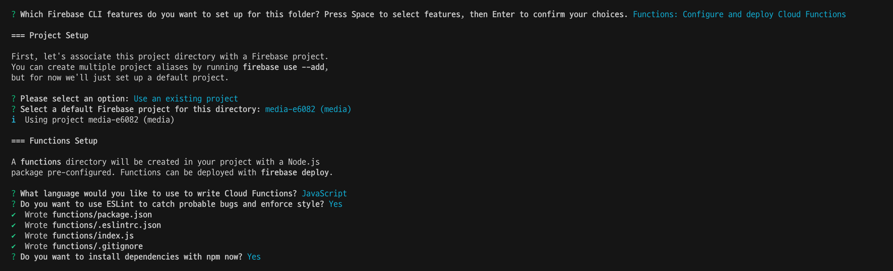
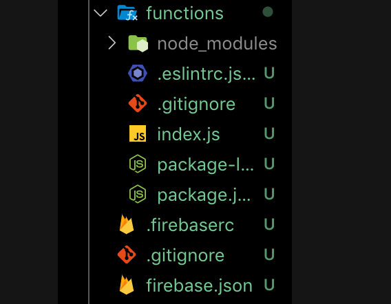
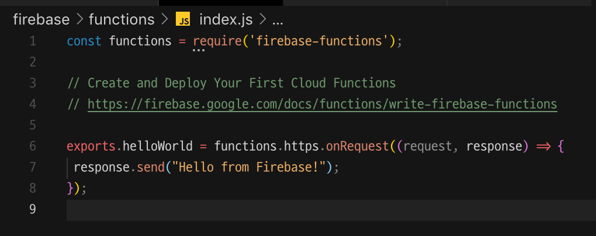

# firebase functions 란

서버를 굳이 생성하지 않고 API단위로 코드를 생성하여 필요할때에 알맞게 사용할 수 있는 기능입니다 !

주로 사용하는 기능으로는

Node.js에서 사용하는 방법은 다음과 같습니다.

> 프로젝트를 생성했다는 기준으로 시작합니다.

---

먼저 firebase를 사용 해야 하기 때문에 설치해줍니다.

```
npm install -g firebase-tools
```

자신의 계정을 인증해야합니다.

```
firebase login
```

프로젝트를 초기화 해줍니다.

```
firebase init
```


사용해볼 기능은 functions이기때문에 functions만 선택해주시고, 나머지는 여러 설정들을 원하는대로 잘 선택해주시면됩니다!



> 초기 셋팅을 아주 잘 해줍니다.



functions라는 폴더 안에 여러가지 셋팅이 생성되는데 그중 index.js를 열어서 주석처리 된 내용을 주석해제하시면 놀랍게도 함수 하나가 구현되어있습니다!



> 명령어 하나만 입력하면 이제 첫번째 함수가 생깁니다!

`npm deploy`

박수 짝짝!!
